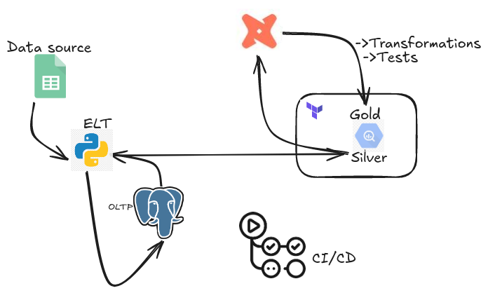

## Modern-Datastack
Analytics engineering and dataops 

### Python + GitHub Actions + dbt Cloud + Terraform: Incremental Loading on BigQuery

### Project Overview
This project demonstrates an **end-to-end data pipeline** leveraging:

- **Python scripts** to ingest data from Google Sheets into PostgreSQL.
- **Incremental loading** from PostgreSQL to BigQuery (Silver dataset).
- **dbt Cloud** for transformations, testing, and loading into the Gold dataset.
- **Terraform** for infrastructure provisioning.
- **GitHub Actions** for CI/CD 

### Incremental Loading
The pipeline optimizes data transfer to BigQuery by **only loading new records** since the last successful load.

**How it works:**
1. **Get last load timestamp**  
   - The script queries the target BigQuery table for the latest timestamp in a specified column.
2. **Extract only new data**  
   - PostgreSQL is queried for rows with a timestamp **greater** than the last load.
3. **Append to BigQuery**  
   - New rows are appended to the existing table without overwriting previous data.
4. **Fallback to full load**  
   - If the target table doesn't exist or is empty, a full loadwh is performed.

Why?
- Reduce processing time.
- Minimizes API/data transfer.
- Ensure no duplication of previously loaded data.

### Data Flow
1. **Google Sheets → PostgreSQL**  
   - Extract data from a ticker list sheet and historical ticker sheets.  
   - Store in PostgreSQL for quick local analysis.
   
2. **PostgreSQL → BigQuery (Silver)**  
   - Incrementally load tables based on their timestamp column.
   
3. **dbt Cloud → BigQuery (Gold)**  
   - Transform and test data before making it analytics-ready. *(Section below is a placeholder)*

### dbt Transformations & Testing

